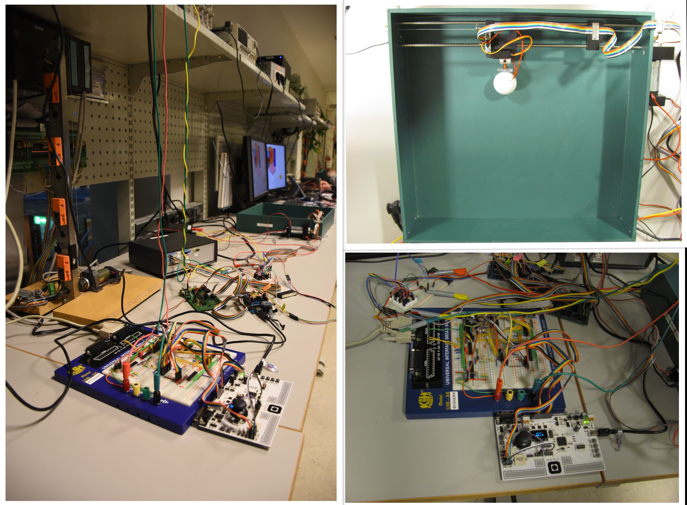

# IndstrlAndEmbdCompSysDsgn-PingPongGame
### The *"Ping Pong Game"* project developed for the *"Industrial and Embedded Computer Systems Design"* course within the *EMECS* Masters

- **Date**: December 2016
- **Purpose**: The purpose of this project is to create a computer controlled electromechanical ping pong game. The electronic components, game boards and development tools needed to realize the game were given. The hardware components needed to be assembled and the software for the microcontrollers needed to be developed.
- **Programming Language**: C
- **Team** (#39):
  - Vitor Ribeiro Roriz
  - Jens Meißner
  - Alexandru Cohal
- **System**:
  - The system was divided in 3 main parts:
    - *Node 1* - based on the *AVR ATmega 162* microcontroller
    - *Node 2* - based on the *Arduino MEGA 2560* board (*AVR ATmega 2560* microcontroller)
    - *USB Multifunction Card* - containing an OLED display, a joystick and 4 touch sensors
  - The connection between the nodes was done using a CAN bus
  - For more information about the task see [this document](https://github.com/alexandru-cohal/IndstrlAndEmbdCompSysDsgn-PingPongGame/blob/master/documentation/TTK4155TermProject-AssignmentText.pdf)
- **Results**:
  - The final outcome can be seen in the following image
  
